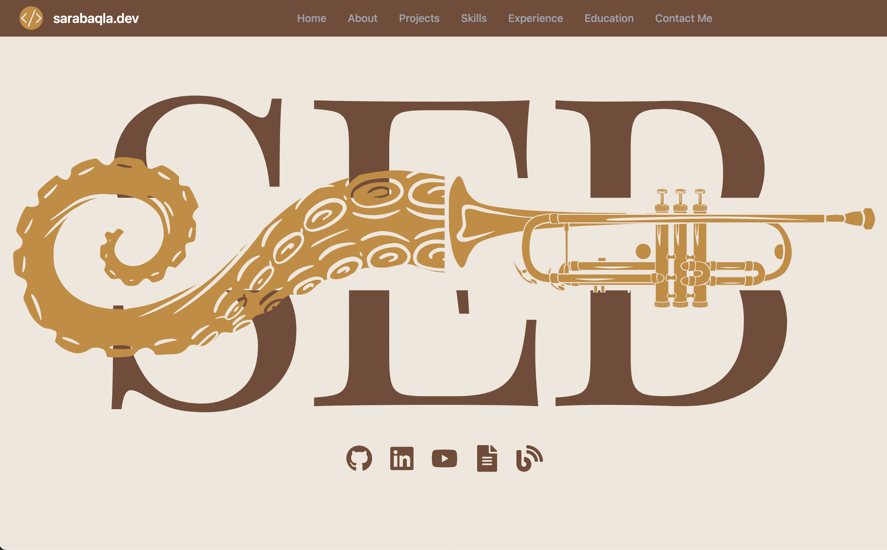

## Portfolio

Welcome to the Vite Portfolio repository, a project that showcases my professional journey and projects. This portfolio reflects who I am both as a developer and an individual.



### 🚀 [Live Demo](https://www.shivam207.github.io/portfolio)

Hosted on Github Pages, ensuring a smooth experience for every visitor.


### 📱 Mobile Optimized

This site has been meticulously designed to ensure an optimal viewing experience across devices. For a quick peek into the mobile navigation, check out this GIF:


### 🔧 Built With

- [**React**](https://react.dev/): A powerful library for building UI components.
- [**Vite**](https://vitejs.dev/): A blazing fast frontend build tool, making the development process a breeze.
- [**Tailwind CSS**](https://tailwindcss.com/): A utility-first CSS framework for rapidly building modern user interfaces.
- [**React-Spring**](https://www.react-spring.dev/): A spring physics based animation library that adds that extra flair to the site's interactions.
- [**React Vertical Timeline Component**](https://www.npmjs.com/package/react-vertical-timeline-component): Used to chronologically display my job experience.
- [**EmailJS**](https://www.emailjs.com/): Ensures that anyone reaching out through the contact form gets their messages delivered directly to my inbox.
- [**React-Router-Dom**](https://reactrouter.com/en/main): Handles seamless navigation throughout the site.

### 🎥 Highlights

1. **Quick Access Icons**: From the landing page, users can quickly navigate to my GitHub, LinkedIn, view my resume.
2. **Interactive Project Cards**: The projects page showcases a collection of cards. Hovering over each card reveals its title, a quick summary, and icons leading to the deployed project and its associated GitHub repository.

### 📬 Get in Touch

Found something interesting? Want to chat about a project or just say hi?  You can always reach out to me via the provided social icons.

### 📜 License

This project is open-source under the MIT License.

---
### 🛠️ Local Setup

You can set up this project locally by following these steps:

#### Using HTTPS:
```
git clone https://github.com/shivam207/portfolio.git
cd portfolio
npm install
npm run dev
```

#### Using SSH:
```
git clone git@github.com:shivam207/portfolio.git
cd portfolio
npm install
npm run dev
```

